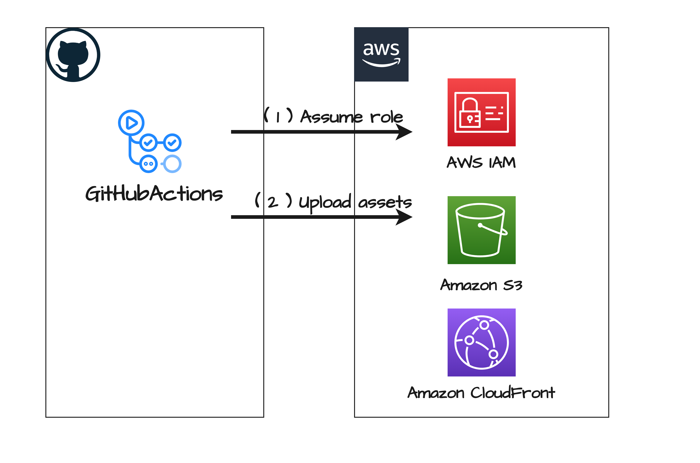

# aws-oidc-provider-for-github

## Description

AWS CDK を用いた GitHub Actions から AWS へアクセスするための OIDC 認証プロバイダー定義例.

静的ファイルを S3 バケットにアップロードし, CloudFront で配信するユースケースを想定して定義している.

## Architecture Overview

  

## Reference

- [アマゾン ウェブ サービスでの OpenID Connect の構成](https://docs.github.com/ja/actions/security-for-github-actions/security-hardening-your-deployments/configuring-openid-connect-in-amazon-web-services)
